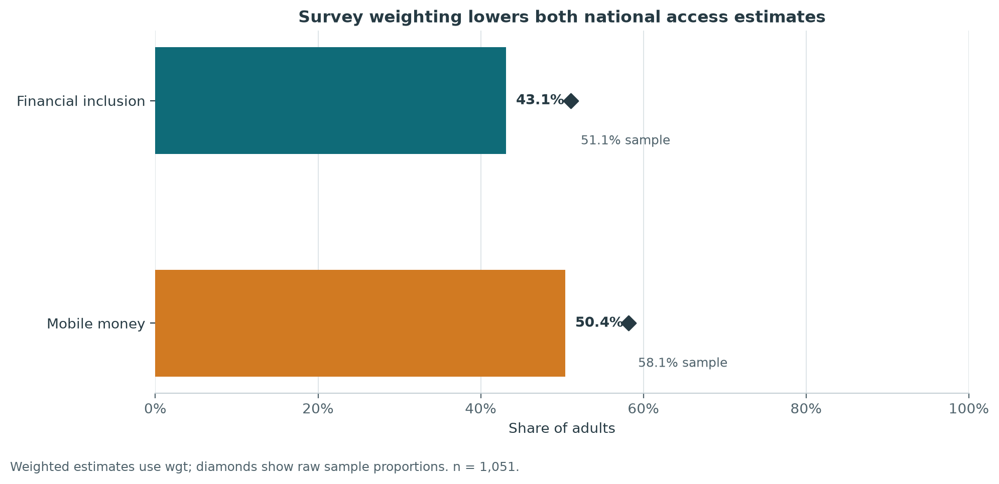
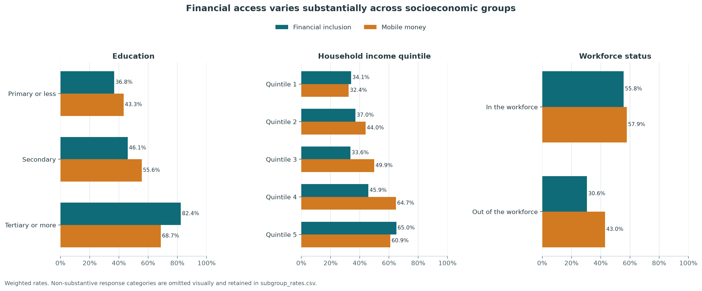
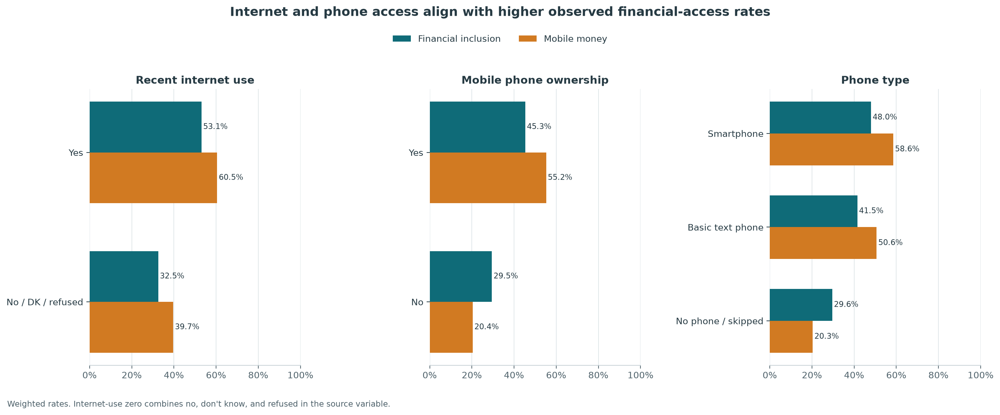
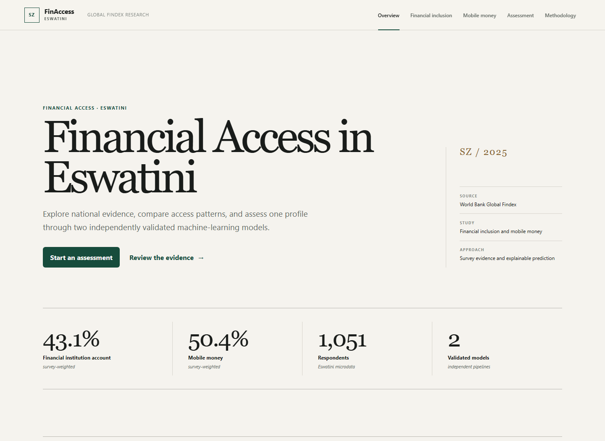
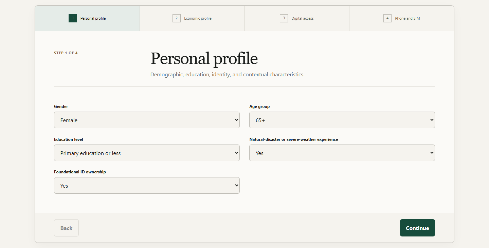
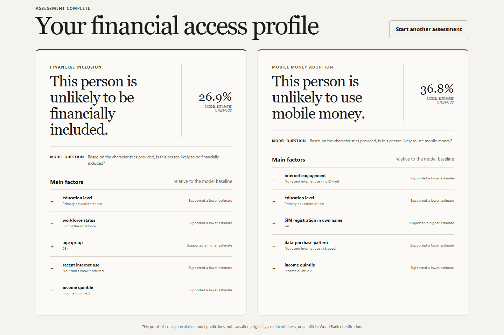

# FinAccess Eswatini

An explainable machine-learning system that analyses financial access in Eswatini and estimates whether an individual profile is likely to be financially included or use mobile money.

## 1. Project Overview

Financial inclusion affects how people save, receive payments, manage emergencies, and participate in the wider economy. However, access to formal financial services and mobile money is not distributed equally.

FinAccess Eswatini uses World Bank Global Findex microdata to answer two questions:

- Is a person with a given demographic, socioeconomic, and digital-access profile likely to be financially included?
- Is that person likely to use mobile money?

The project combines survey-weighted analysis, statistical testing, two independently designed machine-learning models, SHAP explanations, a FastAPI service, and a responsive web application.

Potential users include researchers, financial-inclusion practitioners, policymakers, and development organisations. It is a proof of concept and not a financial eligibility or credit decision system.

## 2. Project Objectives

- Measure and describe financial inclusion and mobile-money adoption in the Eswatini dataset.
- Identify demographic, socioeconomic, and digital characteristics associated with both outcomes without making causal claims.
- Build separate, leakage-reviewed prediction pipelines for financial inclusion and mobile-money adoption.
- Explain global model behaviour and individual predictions using SHAP.
- Deliver both models through one validated API and one accessible web assessment.

## 3. Dataset

| Item | Description |
|---|---|
| Source | [World Bank Global Findex Eswatini microdata](https://microdata.worldbank.org/catalog/7900) |
| Survey reference | `SWZ_2024_FINDEX_v02_M` |
| Publication/database edition | Global Findex 2025 |
| Respondents | 1,051 |
| Raw variables | 199 |
| Model 1 target | `account_fin` - financial institution account ownership |
| Model 2 target | `account_mob` - mobile-money account ownership |
| Model 1 predictors | 15 leakage-reviewed features |
| Model 2 predictors | 16 leakage-reviewed features |

Important variables include age, gender, education, household income quintile, workforce status, recent internet use, phone access, phone capability, SIM registration, and selected digital-engagement measures.

## 4. Project Workflow

```text
World Bank Global Findex Microdata
                ↓
Data Audit and Data Dictionary
                ↓
Target-Leakage and Feature Eligibility Review
                ↓
Data Cleaning and Preprocessing
                ↓
Exploratory Data Analysis
                ↓
Statistical Analysis
                ↓
Feature Engineering
                ↓
Independent Model Training and Evaluation
                ↓
SHAP Explainability
                ↓
FastAPI Prediction Service
                ↓
Next.js Web Application
                ↓
Vercel Deployment
```

## 5. Exploratory Data Analysis

The analysis uses survey weights for descriptive population estimates and retains unweighted sample counts for transparency.

Main findings:

- The survey-weighted financial-inclusion estimate was **43.1%**.
- The survey-weighted mobile-money account estimate was **50.4%**.
- Financial inclusion ranged from **36.8%** among respondents with primary education or less to **82.4%** among those with tertiary education or more.
- Financial inclusion increased from **34.1%** in income quintile 1 to **65.0%** in income quintile 5.
- Mobile-money adoption was **60.5%** among recent internet users and **39.7%** in the combined no/don't-know/refused group.
- Seven of eight pre-specified associations remained significant after false-discovery-rate adjustment for each outcome; gender did not.

### Overall access estimates



### Socioeconomic patterns



### Digital-access patterns



These are observational associations, not evidence that any characteristic causes either outcome.

## 6. Feature Engineering

- **Missing values:** routed questions, special responses, and genuine nonresponse were converted into explicit semantic categories instead of being silently imputed.
- **Categorical encoding:** model pipelines use one-hot encoding learned inside training folds, with safe handling for previously unseen categories.
- **Scaling:** no separate numeric scaling was required in the final matrices because the approved predictors are categorical and age is represented through fixed age bands.
- **New features:** fixed age groups and phone-access tiers were created for both models. Internet-engagement and data-purchase patterns were created only for the mobile-money model.
- **Feature selection:** all 199 variables were reviewed for identifiers, metadata, missingness, prediction timing, target derivation, post-outcome behaviour, and conceptual leakage.
- **Rejected features:** direct target representations, parallel financial outcomes, post-outcome behaviours, an arbitrary digital-access score, and same-period online-activity breadth were excluded.

The final feature sets are intentionally different: 15 predictors for financial inclusion and 16 for mobile-money adoption.

## 7. Models

Four candidate model families were trained independently for each outcome. The tables show mean group-aware cross-validation ROC-AUC on the training partition.

### Model 1: Financial Inclusion

| Model | Mean CV ROC-AUC | Decision |
|---|---:|---|
| Logistic Regression | 0.756 | Not selected |
| Decision Tree | 0.706 | Not selected |
| Random Forest | 0.759 | Competitive |
| Gradient Boosting | **0.768** | **Selected** |

Gradient Boosting was selected because it achieved the strongest cross-validation ROC-AUC while maintaining a controlled train-to-validation gap and good protected-holdout performance.

### Model 2: Mobile-Money Adoption

| Model | Mean CV ROC-AUC | Decision |
|---|---:|---|
| Logistic Regression | 0.710 | **Selected** |
| Decision Tree | 0.687 | Not selected |
| Random Forest | **0.716** | Competitive but more complex |
| Gradient Boosting | 0.712 | Competitive but more complex |

Logistic Regression was selected using a one-standard-error complexity rule. Its cross-validation performance was statistically competitive with the highest-scoring candidate while providing a simpler and more interpretable final pipeline.

## 8. Results

Final results were measured once on model-specific protected holdouts after model selection.

| Metric | Financial Inclusion | Mobile-Money Adoption |
|---|---:|---:|
| Holdout respondents | 211 | 210 |
| Accuracy | 0.706 | 0.676 |
| Precision | 0.717 | 0.721 |
| Recall | 0.704 | 0.721 |
| F1 score | 0.710 | 0.721 |
| ROC-AUC | **0.745** | **0.726** |
| Balanced accuracy | 0.706 | 0.667 |
| Brier score | 0.204 | 0.205 |

Identical predictor profiles were grouped so matching profiles could not appear across training, validation, and holdout partitions. Bootstrap intervals were also calculated because the holdouts are small; the ROC-AUC intervals were 0.674-0.805 for Model 1 and 0.657-0.791 for Model 2.

Model explanations were generated using a Tree SHAP explainer for Model 1 and a Linear SHAP explainer for Model 2. SHAP contributions were aggregated back to understandable source variables and validated for additivity.

## 9. Final Solution

The finished product combines analytical evidence, both models, and their explanations in one light, responsive financial-access platform.

### Dashboard overview

<p align="center">
  
</p>

### Prediction interface

<p align="center">
  
</p>

### Model output example

<p align="center">
  
</p>

One submitted profile is validated once, routed through two separate preprocessing pipelines, scored by both models, and returned with two natural-language answers, supporting probabilities, and five model-derived factors per outcome.

## 10. Tech Stack

- **Data science:** Python 3.13, Pandas, NumPy, SciPy, scikit-learn
- **Statistical analysis:** SciPy, chi-square tests, Mann-Whitney tests, effect sizes, Benjamini-Hochberg adjustment
- **Explainability:** SHAP, model-native feature importance
- **Visualisation:** Matplotlib, SVG and PNG analytical outputs
- **API:** FastAPI, Pydantic, Uvicorn, Joblib
- **Frontend:** Next.js 16, React 19, TypeScript, responsive CSS
- **Testing:** Python `unittest`, Node test runner, rendered-route checks
- **Deployment:** Vercel Services and Vercel Python runtime
- **Version control:** Git and GitHub

## 11. Repository Structure

The local project workspace is organised as follows:

```text
FinAccess-Eswatini/
├── data/
│   ├── raw/                         # Local, Git-ignored microdata
│   ├── processed/                   # Reproducible modelling matrices
│   └── README.md
├── notebooks/
│   ├── 01_data_understanding.ipynb
│   ├── 02_data_dictionary_feature_eligibility.ipynb
│   ├── ...
│   └── 13_portfolio_polish.ipynb
├── src/finaccess_eswatini/          # Reusable analytical and ML code
├── models/                          # Validated pipelines and SHAP explainers
├── api/                             # Standalone FastAPI application
├── frontend/
│   ├── web/                         # Next.js application
│   ├── backend/                     # Vercel FastAPI inference package
│   └── vercel.json
├── reports/                         # Tables, figures, audits, and phase reports
├── scripts/                         # Reproducible phase and validation runners
├── tests/                           # Data, model, API, deployment, and portfolio tests
├── requirements.txt
├── requirements-lock.txt
├── pyproject.toml
├── .gitignore
└── README.md
```

### Why the project currently uses two GitHub repositories

- `finaccess-eswatini` contains the complete analytical workflow, notebooks, reports, tests, and primary project documentation.
- `finaccess-eswatini-web` contains the smaller Vercel deployment package: the Next.js application, FastAPI inference service, and validated model artifacts.

This split kept raw and processed respondent data out of the deployment source and made the Vercel package smaller. The two repositories can be consolidated later, but that should be done together with a controlled Vercel source migration so the live deployment is not interrupted.

## Responsible Use and Limitations

- This is a portfolio proof of concept, not a nationwide production financial decision engine.
- The dataset is observational; analysis, predictions, and SHAP explanations do not establish causation.
- The protected holdouts are small and model-performance estimates have material uncertainty.
- The 0.50 prediction thresholds are provisional and are not tied to an operational policy or cost function.
- Recent digital-behaviour variables in Model 2 overlap the outcome observation period and remain a documented conceptual limitation.
- Submitted assessment profiles are not persisted by the API.

## Explore the Live Project

**[Launch FinAccess Eswatini](https://finaccess-eswatini.vercel.app)**

Developed by **Thando F. Dlamini**.
